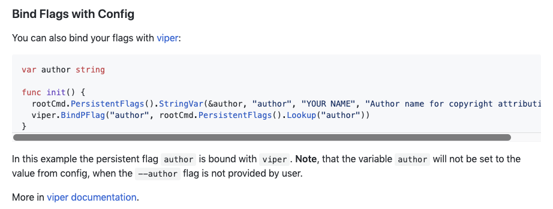

class: center, middle

# oclifconf

---

class: center, middle

## oclif has quickly become the go-to tool for building CLIs with Node.js

---

class: center, middle

# Launched February 2018

#### Estimated \>1m oclif-based CLI downloads/week

---

class: center, middle

#### \>3k oclif generator downloads/week

---

class: center, middle
.fit[]
#### \>3k github stars

---

## In particular people like:

* Using TypeScript to build their CLI
* The generator
* Plugin support
* Autoupdates
* Autocomplete
* Scalability

---

class: center, middle
.fit[]

#### I'm moving on from Node/CLI development, but here are some of the things I wasn't able to get around to completing

---

# Space-separated CLI

```
$ heroku apps:destroy
# versus:
$ heroku apps destroy
```

--

```
$ mycli plugins:install @oclif/plugin-spaced-commands
```

---

# Space-separated CLI

Can't have topic-commands accept arguments:

```
$ mycli TOPIC ARG
```

vs

```
$ mycli TOPIC SUBTOPIC
```

---

# Global flags


---

# did-you-mean for flags

```
$ heroku config:set FOO=bar --ap=myapp
Did you mean "--app"?
```

---

# Config binding

* `echo '{"foo": "bar"}' > ~/.config/mycli.json`
* `export MYCLI_CONFIG_FOO=bar`
* `mycli --foo=bar`



---

# Zero-config oclif

```sh-session
$ cat <<EOF > mycommand.ts
import {Command} from '@oclif/command'

class MyCommand extends Command {
  async run() {
    this.log('single file!')
  }
}
EOF
$ oclif run
single file!
$ oclif build
...
$ oclif publish
...
```

---

# Remove `this.parse()`

```typescript
class MyCommand extends Command {
  static flags = {
    foo: flags.string()
  }

  // current:
  async run() {
    const {flags} = this.parse(MyCommand)
    // do something with flags.foo
  }

  // ideal:
  async run() {
    // do something with this.flags.foo
  }
}
```

---

# Remove `this.parse()`

```typescript
class MyCommand extends Command<{foo: string?}> {
  static flags = {
    foo: flags.string()
  }

  async run() {
    // this.flags.foo: string
  }
}
```

---

# Native Dependencies


```
$ yarn add bcrypt
```

Issues:

* Autoupdating
* Multi-machine builds
* Client-side compilation

---

# npm autoupdating


```
$ npm install -g mycli
$ mycli update
```

---

# perf diagnostics


---

# Generator improvements


.fit[]

---

class: middle

# Generator improvements

* Refactor
* ESLint
* pnpm
* config
* windows builds

---

# @oclif/plugin-help

* pluggability
* docusaurus site generator
* man page support


---

# Testing

* should fancy-test be merged?
* could testing be rethought?
* jest?


---

# Analytics/error handling service

* React front-end
* Back-end to store user exceptions and usage statistics
* Possibly also with badge utility to track GitHub repo or npm package views

---

# Dynamic commands

* Hard Mode.
* Would work against current dispatching logic

---

class: center, middle

# oclifd


